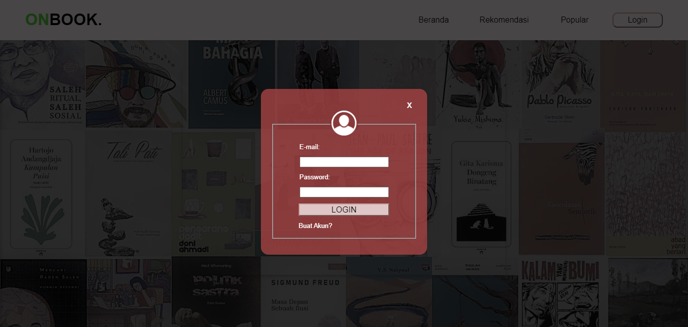
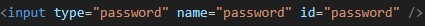
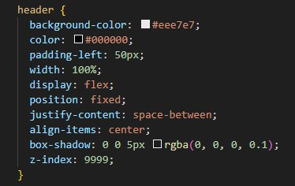

# 2022a-kelompok6
link hosting : https://22091397005muhammadainurrofik.github.io/2022a-kelompok6/buku.html

Software Requirements
Specification

for

OnBook Website

Version 1.0 approved

Disusun Oleh :

1. Muhammad Ainur Rofik (22091397005)
2. Farida Muthi’ah Fathin (22091397007)
3. Yunike Shandy Jholan Ninggar (22091397008)

D4 Manajemen Informatika 2022 A Fakultas Vokasi Universitas Negeri Surabaya

Tahun 2023

**1. Introduction**

 Pada era revolusi industri 5.0 ini banyak teknologi yang berkembang di berbagai daerah, terutama perkembangan pada design dan website. Contoh perkembangan teknologi pada bidang desain sendiri yaitu seperti adanya aplikasi-aplikasi mengenai colour pallet dan ada juga aplikasi yang menyediakan objek gambar untuk akses pengeditan dan masih banyak lagi. Kemudian pada website sendiri banyak dipakai oleh orang untuk mempermudah mereka untuk pencarian sesuatu lebih cepat. Banyak fungsi website yang dikembangkan pada era ini, seperti model tampilan yang dipercantik, banyak fitur baru yang ditambahkan, kemudian juga mempermudah user dalam mengakses website tersebut. Di sini kami membuat website dengan nama OnBook. Tujuan kami membuat website ini yaitu untuk membantu user agar lebih mudah dalam mencari toko penjual buku yang dicari oleh user itu sendiri, selain itu juga untuk memberikan gambaran kepada user tentang buku yang ingin dibeli.
 Website ini menjelaskan tentang penjualan buku yang mungkin ada pada toko-toko buku yang tersambung atau sudah bekerja sama dengan website kami. Yang mana website kami akan memberitahukan informasi tentang buku yang dicari oleh user, kemudian website OnBook akan menampilkan buku-buku dan harga pada buku tersebut, setelah itu akan ditunjukkan rekomendasi toko-toko yang menjual buku yang dicari. Pada awalnya website kami hanya dirancang secara sederhana hanya untuk menampilkan harga buku-buku yang ada, namun setelahnya dirubah menjadi lebih kompleks dan juga lebih rapi. Di sini juga ditambahkan fitur untuk menampilkan toko yang berjualan buku yang dicari untuk mempermudah user.

1.1 Purpose

Dokumen ini berisi Software Requirement Specification (SRS). Tujuan dibuatnya dokumen ini yaitu untuk memperjelas pengertian dari website OnBook secara lebih rinci dan lebih jelas untuk mempermudah pembaca. Dokumen SRS ini juga bertujuan memudahkan pengguna atau audiens untuk lebih mengerti mengenai website SRS yang dibuat. Diharapkan website ini dapat membantu pengguna agar lebih teliti ketika ingin membeli buku, karena website ini akan menjelaskan isi detail setiap jenis buku.

1.2 Document Conventions
Di sini akan dijelaskan mengenai singkatan dan pengertian dari file juga istilah yang berhubungan dengan website yang dibuat. Berikut konversi dokumen yang kami gunakan pada website OnBook:
- Software : Perangkat lunak yang berisikan data atau file yang dapat disimpan, dibuka, dan dibaca pada komputer.
- Website : Yaitu halaman informasi yang disediakan melalui jalur internet yang bisa diakses oleh seluruh dunia selama terkoneksi dengan internet.
- Domain : Alamat website, yaitu dapat mengantarkan kita ke alamat website yang dituju.
- Server : Merupakan sistem komputer yang memiliki layanan khusus berupa penyimpanan data.
- HTML : Hypertext Markup Language merupakan bahasa yang digunakan untuk membuat struktur website ini.
- CSS : Cascading Style Sheet yaitu bahasa yang digunakan untuk mengatur tampilan website OnBook ini.
- Format penulisan pada dokumen SRS ini menggunakan font Arial dengan spasi 1 berwarna hitam. Prioritas dari website “OnBook” ini adalah untuk memberikan informasi kepada pembaca mengenai buku-buku, seperti novel, komik, ensiklopedia, pengetahuan, dan lain sebagainya. Website ini akan memberikan ulasan buku yang disediakan informatif, terstruktur dengan baik, dan ditulis dengan gaya bahasa yang menarik.

1.3 Intended Audience and Reading Suggestions
Dokumen ini dipertunjukkan kepada beberapa pihak, yaitu:
- Pengguna. Pengguna dapat menggunakan dokumen ini untuk referensi isi website OnBook dan mengetahui rincian website OnBook. Pengguna yang dituju yaitu semua orang yang memiliki smartphone dan yang ingin mengetahui harga buku di toko-toko yang menjualnya (biasanya anak-anak, remaja atau orang dewasa).
- Audiens. Audiens yang dituju adalah semua umur dari kecil sampai dewasa. Terutama yang tertarik untuk membeli buku tetapi masih kurang yakin dengan isi bukunya dan kebingungan dimana untuk membeli buku dimana.

Saran pengembangan dalam website OnBook yaitu:
1. Meningkatkan fitur keamanan. Dengan meningkatkan fitur keamanan dapat memberikan kenyamanan lebih bagi user tanpa mengkhawatirkan akan data-data pribadinya.
2. Pengembangan AI pada website OnBook. Mengembangkan website untuk meningkatkan fungsi website ini sendiri. Contohnya seperti menyediakan fitur belanja online dan kerjasama dengan aplikasi Shopee.
3. Mmperhatikan Ulasan Pengguna. Ulasan dari pengguna harus diperhatikan dan kita sebagai pengelola harus bisa mengembangkan aplikasi sesuai dengan ulasan dan lebih memperbaikinya lagi.

1.4 Product Scope
OnBook merupakan website yang dibuat untuk memudahkan pengguna dalam mencari dan membeli buku yang diinginkan. Pada website ini pengguna dapat mengetahui dari cover buku dan deskripsi dari buku tersebut. Jadi pengguna dapat mempertimbangkan keinginannya untuk membeli buku dengan cara mengetahui deskripsi dan rate buku-buku tersebut. Untuk fitur sendiri terdapat akses login dan ber, yang mana pada login pengguna harus memasukkan email beserta kata sandinya. Terdapat halaman rekomendasi yang menampilkan buku-buku yang mungkin disukai oleh pengguna. Dan yang terakhir adalah halaman popular, menampilkan buku-buku yang paling banyak dibeli oleh para pengguna dan yang paling banyak memiliki rate tertinggi. Website ini juga menyediakan fitur notifikasi, jadi jika ada buku terbaru yang masuk kategori popular maupun rekomendasi akan muncul notifikasi pada handphone maupun PC.

**2. Overall Description**

2.1 Product Perspective

OnBook merupakan website yang didesain dan dibuat untuk memudahkan pengguna mengetahui buku-buku yang ingin dicari. Pada website OnBook ini setiap buku yang dicari akan menjelaskan deskripsi dari buku tersebut. Pengguna yang akan membeli buku dapat mencari tahu isi buku di website ini. Cara kerja website ini yaitu pengguna hanya perlu login menggunakan email dan memasukkan passwordnya untuk masuk website agar website bisa berjalan dengan lancar.

2.2 Product Functions

Website ini dikembangkan dengan melakukan beberapa fungsi sebagai berikut:
- Registrasi akun: Fungsi memungkinkan pengguna website OnBook untuk membuat akun dan pengguna dapat mengisi data pribadi seperti Email dan kata sandinya.
- Menampilkan tampilan dan deskripsi buku: Fungsi ini untuk memudahkan pengguna dalam mencari buku yang diinginkan dan mengetahui isi deskripsi buku tersebut.
- Menampilkan toko penjual buku: Pada bagian ini menunjukkan toko yang menjual buku yang dicari pengguna, contohnya Gramedia.

2.3 User Classes and Characteristics
Hak Akses dari Website OnBook adalah sebagai berikut:
- Admin : Hak akses pada setiap data yang ada. Mendata email beserta kata sandi yang sudah masuk pada website.
- Pengguna : Mengisi ketentuan seperti email dan kata sandi pada halaman login. Memberikan ulasan ke website OnBook. Melihat rekomendasi buku dan toko penjual buku.

2.4 Operating Environment
Website OnBook dapat beroperasi berdasarkan spesifikasi sebagai berikut:
- Dapat diakses selama 24 jam
- Tidak adanya ketentuan minimal RAM pada laptop atau smartphone
- Bisa diakses kapan saja dan dimana saja asalkan terhubung dengan internet yang baik

2.5 Design and Implementation Constraints
Kendala yang mungkin terjadi pada website OnBook yaitu:
- Jaringan internet yang tidak stabil. Karena website OnBook ini harus memakai akses internet, ketidakstabilan jaringan dapat mengganggu pengguna dalam menjalankan website ini.
- Kurangnya keamanan. Karena pada website kami diperlukan email dan password email, dikhawatirkan email yang dipakai bisa dibobol oleh pihak yang tidak bertanggung jawab.

2.6 User Documentation
   Dalam pengimplementasiannya, website OnBook komponen dokumentasi yang dapat diberikan sebagai bantuan untuk menyelesaikan masalah dalam mengakses website OnBook yaitu:
   - Video Tutorial: Video ini berfungsi untuk memberitahu pengguna tutorial cara mengakses website yang baik dan benar. Akan diberitahukan step-one-step dalam penjelasan penggunaan website.
   - Adanya fitur komentar: Mempermudah pengguna untuk menyampaikan keluh kesahnya atas pelayanan website yang dibuat.
   
2.7 Assumptions and Dependencies
Website OnBook ini mempunyai dua interface. Yang pertama yaitu dapat dikunjungi oleh admin. Di sini admin memiliki hak akses untuk melihat dan juga mengelola semua data-data dari user. Semisal terjadi hal yang mencurigakan d dalm data, admin dapat menindaklanjuti hal tersebut. Interface yang selanjutnya yaitu tampilan halaman website OnBook bagi para user. Di sini user memiliki hak akses pada segala hal yang sudah disediakan dalam web OnBook sendiri. Seperti pencarian buku, rekomendasi, toko, dan lain sebagainya.

**3. External Interface Requirements**

3.1 User Interfaces

   Antarmuka pengguna yang ada pada website OnBook adalah sebagai berikut:
      1. Ber: Pada halaman ber ini, terdapat menu login untuk pengguna
      2. Rekomendasi: Halaman ini menampilkan beberapa buku rekomendasi yang disarankan kepada pengguna
      3. Popular: Halaman ini akan menampilkan buku-buku yang sedang popular

3.2 Hardware Interfaces

   Website Onbook didukung pada SmartPhone maupun PC yang terhubung dengan jaringan internet. Perangkat keras lainya yang mendukung pengaksesan website OnBook dapat dijelaskan seperti berikut:
      1. SmartPhone/PC : Untuk mengakses website OnBook
      2. Monitor : Menampilkan halaman website OnBook
      3. Keyboard : Untuk memasukkan input ke website OnBook
      4. Mouse : Untuk mempermudah navigasi pengguna

3.3 Software Interfaces

   Kebutuhan antarmuka perangkat lunak sangat dibutuhkan untuk membuat websie OnBook. Berikut adalah beberapa hal yag dibutuhkan untuk membuat website OnBook:
      1. HTML: HTML digunakan untuk mendefinisikan struktur dasar halaman web, menyusun teks, paragraf, daftar, dan elemen-elemen teks lainnya, serta untuk menghubungkan halaman web dan membentuk struktur navigasi.
      2. CSS : CSS digunakan untuk mengubah tampilan elemen-elemen HTML, termasuk warna latar belakang, teks, font, dan border.

3.4 Communications Interfaces

   Website OnBok membutuhkan laptop, PC, maupun SmartPhone yang tersambung ke internet.

3.5 Desain Graphical User Interface

## Penjelasan HTML

1. tag **title** digunakan untuk menentukan judul halaman web yang akan ditampilkan di bilah judul peramban.
Contoh penggunaan:

2. tag **link** adalah elemen link yang menghubungkan file CSS eksternal ke halaman HTML. Atribut href adalah URL file CSS, dan atribut type menunjukkan tipe file tersebut.
Contoh penggunaan:

3. tag **header** berisi elemen-elemen yang mewakili bagian atas halaman web, termasuk judul, navigasi, dan elemen lainnya.
Contoh penggunaan:

4. tag **h1**, **h3**, **h4**, **h5** adalah elemen heading yang digunakan untuk menampilkan judul dan subjudul dengan tingkat kepentingan yang berbeda. h1 adalah yang paling penting dan biasanya digunakan untuk judul utama.
Contoh penggunaan:

5. tag **nav** digunakan untuk mengelompokkan elemen navigasi, seperti tautan ke halaman web lain atau menu.
Contoh penggunaan:

6. tag **ul** adalah daftar tak terurut (unordered list) yang digunakan untuk membuat daftar tautan atau elemen lain.
Contoh penggunaan:

7. tag **a** adalah elemen anchor (tautan) yang digunakan untuk menghubungkan ke halaman web lain. Dalam kode, tautan ini digunakan untuk navigasi atau pun untuk menuju ke halaman lain.
Contoh penggunaan:

8. tag **button** adalah tombol yang digunakan untuk memicu tindakan tertentu, seperti navigasi atau tindakan JavaScript. Dalam kode , tombol ini digunakan untuk navigasi dan tindakan seperti membuka popup.
Contoh penggunaan:

9. tag **div** adalah elemen umum yang digunakan untuk mengelompokkan dan menggantungkan elemen-elemen lain dalam blok.
Contoh penggunaan:

10. tag **span** digunakan untuk menerapkan gaya pada sebagian teks dalam elemen lain, seperti mengganti warna teks.
Contoh penggunaan:

11. tag **img** digunakan untuk menampilkan gambar di halaman web. Atribut src adalah URL gambar.
Contoh penggunaan:

12. tag **fieldset**, **legend** : **fieldset** digunakan untuk mengelompokkan elemen formulir, dan **legend** digunakan untuk memberi judul untuk kelompok tersebut. Dalam kode , ini digunakan untuk mengelompokkan elemen-elemen formulir.
Contoh penggunaan:

13. tag **label** digunakan untuk memberi label pada elemen formulir, seperti input teks.
Contoh penggunaan:

14. tag **input** adalah elemen formulir yang digunakan untuk menerima masukan dari pengguna. Dalam kode , ini digunakan untuk input email dan password.
Contoh penggunaan:

16. tag **table**, **tr**, **td**, **th**: Elemen-elemen ini digunakan untuk membuat tabel dan sel dalam tabel. **table** adalah elemen tabel utama, **tr** adalah baris dalam tabel, **td** adalah sel data, dan **th** adalah sel header dalam tabel.
Contoh penggunaan:

17. tag **footer** digunakan untuk informasi atau tautan di bagian bawah halaman.
Contoh penggunaan:

18. tag **script** digunakan untuk menghubungkan file JavaScript eksternal ke halaman HTML. Atribut src mengacu pada file JavaScript eksternal yang akan dijalankan pada halaman web.
Contoh penggunaan:

## Penjelasan CSS

header adalah pemilih CSS yang menargetkan elemen HTML header. Semua aturan CSS ini akan diterapkan pada elemen header dalam dokumen HTML.
1. background-color: #eee7e7;: Properti ini mengatur warna latar belakang elemen header. Dalam hal ini, latar belakang akan berwarna abu-abu muda (#eee7e7).
2. color: #000000;: Ini mengatur warna teks dalam elemen header. Warna teks diatur menjadi hitam (#000000).
3. padding-left: 50px;: Ini menambahkan jarak (padding) di sisi kiri elemen header. Dalam hal ini, terdapat padding sebanyak 50 piksel di sisi kiri elemen.
4. width: 100%;: Properti ini memberi elemen header lebar 100% dari lebar elemen yang mengandungnya. Dengan kata lain, elemen header akan mengisi seluruh lebar elemen yang mengandungnya.
5. display: flex;: Ini mengatur elemen header untuk menggunakan model tata letak fleksibel. Ini memungkinkan pengaturan tata letak yang lebih kompleks dengan elemen-elemen di dalamnya.
6. position: fixed;: Dengan properti ini, elemen header akan memiliki posisi tetap di layar. Artinya, elemen ini akan tetap terlihat di atas layar saat halaman digulir.
7. justify-content: space-between;: Ini adalah salah satu properti yang digunakan dalam model tata letak fleksibel. Dalam hal ini, elemen-elemen di dalam elemen header akan disebar sejauh mungkin di dalam ruang horizontal, sehingga ada ruang kosong di antara elemen-elemen tersebut.
8. align-items: center;: Ini juga merupakan properti dari model tata letak fleksibel. Ini mengatur elemen-elemen di dalam elemen <header> agar terpusat secara vertikal, sehingga mereka akan berada di tengah vertikal elemen header.
9. box-shadow: 0 0 5px rgba(0, 0, 0, 0.1);: Ini menambahkan bayangan (shadow) pada elemen header. Bayangan ini adalah bayangan dengan warna hitam (rgba(0, 0, 0, 0.1)) yang memiliki ketebalan 5 piksel. Bayangan ini memberikan efek visual yang sedikit menebalkan elemen saat ditempatkan di atas elemen lain.
10. z-index: 9999;: Properti ini mengatur indeks z (z-index) elemen header. Ini digunakan untuk mengendalikan tumpukan elemen yang tumpang tindih. Semakin besar nilai indeks z, semakin tinggi elemen akan muncul di atas elemen-elemen lain dalam dokumen.

nav adalah pemilih CSS yang menargetkan elemen HTML nav. Semua aturan CSS ini akan diterapkan pada elemen nav dalam dokumen HTML.
1. padding-right: 100px;: Properti ini menambahkan jarak (padding) di sisi kanan elemen nav. Dalam hal ini, terdapat padding sebanyak 100 piksel di sisi kanan elemen.

nav ul a button: Ini adalah urutan pemilih (selector) yang menargetkan elemen-elemen berlapis dalam dokumen HTML. Secara berurutan, ini berarti:

nav: Merujuk pada elemen nav.

ul: Merujuk pada elemen-elemen ul (daftar tak terurut) yang berada dalam elemen nav.

a: Merujuk pada elemen-elemen a (tautan) yang berada dalam elemen-elemen ul.

button: Merujuk pada elemen-elemen button yang berada dalam elemen-elemen a.

1. border: none;: Ini menghilangkan batas (border) dari elemen-elemen yang dipilih. Dengan properti ini, elemen-elemen tersebut tidak akan memiliki garis batas.
2. width: 130px;: Properti ini mengatur lebar elemen-elemen yang dipilih menjadi 130 piksel.
3. height: 30px;: Properti ini mengatur tinggi elemen-elemen yang dipilih menjadi 30 piksel.
4. margin-right: 10px;: Ini menambahkan jarak (margin) sebesar 10 piksel di sisi kanan elemen-elemen yang dipilih. Ini akan memberikan jarak antara elemen-elemen yang berdekatan dalam elemen ul.
5. font-size: 16px;: Properti ini mengatur ukuran font teks dalam elemen-elemen yang dipilih menjadi 16 piksel.
6. border-radius: 10px;: Ini mengatur sudut elemen-elemen yang dipilih sehingga memiliki sudut melengkung dengan jari-jari sekitar 10 piksel. Ini memberikan efek estetis sudut melengkung pada elemen.
7. background-color: #eee7e7;: Properti ini mengatur warna latar belakang elemen-elemen yang dipilih. Dalam hal ini, latar belakang akan berwarna abu-abu muda (#eee7e7).

nav ul button: Ini adalah urutan pemilih (selector) yang menargetkan elemen-elemen berlapis dalam dokumen HTML. Secara berurutan, ini berarti:

nav: Merujuk pada elemen nav.

ul: Merujuk pada elemen-elemen ul (daftar tak terurut) yang berada dalam elemen nav.

button: Merujuk pada elemen-elemen button yang berada dalam elemen-elemen ul.

1. width: 100px;: Properti ini mengatur lebar elemen-elemen yang dipilih menjadi 100 piksel.
2. height: 30px;: Properti ini mengatur tinggi elemen-elemen yang dipilih menjadi 30 piksel.
3. font-size: 16px;: Properti ini mengatur ukuran font teks dalam elemen-elemen yang dipilih menjadi 16 piksel.
4. border-color: #c99999;: Properti ini mengatur warna batas (border) elemen-elemen yang dipilih. Dalam hal ini, warna batas ditentukan sebagai #c99999, yang mewakili warna merah muda yang tertentu.
5. border-radius: 10px;: Ini mengatur sudut elemen-elemen yang dipilih sehingga memiliki sudut melengkung dengan jari-jari sekitar 10 piksel. Ini memberikan efek estetis sudut melengkung pada elemen.
6. background-color: #eee7e7;: Properti ini mengatur warna latar belakang elemen-elemen yang dipilih. Dalam hal ini, latar belakang akan berwarna abu-abu muda (#eee7e7).

ul Ini adalah pemilih CSS yang menargetkan elemen-elemen HTML ul. Semua aturan CSS ini akan diterapkan pada elemen-elemen ul dalam dokumen HTML.
1. display: flex;: Properti ini mengatur elemen-elemen ul untuk menggunakan model tata letak fleksibel. Dengan menggunakan display flex, elemen-elemen dalam daftar tak terurut akan mengikuti model tata letak fleksibel, yang memungkinkan pengaturan tata letak yang lebih kompleks dengan elemen-elemen dalam daftar tersebut.

button hover Ini adalah pemilih pseudo-class yang menargetkan elemen-elemen button saat pengguna mengarahkan kursor mouse ke atasnya (hover). Aturan ini akan diterapkan saat pengguna berinteraksi dengan tombol.
1. background-color: #c99999;: Properti ini mengatur warna latar belakang elemen button ketika pengguna menghover elemen tersebut. Dalam hal ini, warna latar belakang berubah menjadi #c99999, yang mewakili warna merah muda yang tertentu.
2. transition: 0.4s;: Properti ini mengatur transisi atau animasi ketika ada perubahan dalam properti-properti CSS. Dalam konteks ini, transisi 0.4 detik (0.4s) akan diterapkan ketika warna latar belakang elemen button berubah. Ini berarti perubahan warna latar belakang akan terjadi dengan efek animasi selama 0.4 detik, memberikan pengalaman hover yang lebih halus.

a Ini adalah pemilih CSS yang menargetkan semua elemen tautan a dalam dokumen. Aturan ini akan diterapkan pada semua tautan dalam halaman web.
1. text-decoration: none;: Properti ini menghilangkan dekorasi teks default dari tautan, seperti garis bawah yang biasanya ada pada tautan. Dengan mengatur text-decoration menjadi none, tautan tidak akan memiliki dekorasi teks, sehingga tautan akan terlihat seperti teks biasa tanpa garis bawah.
2. color: #000000;: Properti ini mengatur warna teks tautan. Dalam hal ini, warna teks tautan ditentukan sebagai hitam (#000000).
3. font-size: 16px;: Properti ini mengatur ukuran font teks dalam tautan menjadi 16 piksel.

a hover Ini adalah pemilih pseudo-class yang menargetkan elemen-elemen a saat pengguna mengarahkan kursor mouse ke atasnya (hover). Aturan ini akan diterapkan saat pengguna berinteraksi dengan tautan.
1. color: #c72323;: Properti ini mengatur warna teks tautan ketika pengguna menghover elemen tersebut. Dalam hal ini, warna teks tautan berubah menjadi #c72323, yang mewakili warna merah tertentu.

1.	font-family: Arial, sans-serif;: Baris ini mengatur jenis font yang akan digunakan untuk teks dalam elemen "body." Itu berarti browser akan mencoba menggunakan font "Arial" jika tersedia di komputer pengguna. Jika "Arial" tidak tersedia, maka browser akan beralih ke jenis font sans-serif yang merupakan jenis font generik yang mudah dibaca. Ini memastikan bahwa teks ditampilkan dengan jenis font yang baik meskipun "Arial" tidak tersedia.
2.	margin: 0;: Baris ini mengatur margin (ruang kosong) dari elemen "body" menjadi 0. Ini menghilangkan margin default di sekitar konten "body," sehingga kontennya akan mencapai tepi tampilan browser.
3.	background-color: #e2d5d5;: Baris ini mengatur warna latar belakang (background) dari elemen "body" ke nilai warna heksadesimal yang diberikan (#e2d5d5). Ini mengubah warna latar belakang keseluruhan halaman web menjadi warna merah muda-beige yang lembut.

containerbook adalah nama class yang akan digunakan untuk mengatur tata letak elemen yang menggunakan class ini.
1.	text-align: center;: Baris ini mengatur alignment (penyelarasan) teks dalam elemen-elemen dengan class "containerbook" menjadi terpusat (centered). Ini berarti teks dalam elemen tersebut akan ditampilkan secara horizontal dalam keadaan terpusat.
2.	display: inline-block;: Baris ini mengatur properti display elemen-elemen dengan class "containerbook" menjadi "inline-block." Ini membuat elemen tersebut memiliki perilaku seperti elemen inline, sehingga mereka dapat tampil berdampingan, tetapi juga memungkinkan  untuk menentukan lebar dan tinggi untuk elemen tersebut. Ini sering digunakan untuk membuat elemen-elemen tampil sebagai kotak (block-like) dalam konten yang bersifat inline.
3.	margin-left: 47px;: Ini menambahkan margin (ruang kosong) di sebelah kiri elemen-elemen dengan class "containerbook" sebesar 47 piksel. Hal ini menciptakan ruang di sebelah kiri elemen, sehingga elemen tersebut akan tergeser dari konten sebelah kiri.
4.	background-color: #ffffff;: Baris ini mengatur warna latar belakang (background color) dari elemen-elemen dengan class "containerbook" menjadi putih (#ffffff). Ini akan memberikan elemen-elemen tersebut latar belakang berwarna putih.
5.	border-radius: 5px;: Ini membulatkan sudut-sudut elemen-elemen dengan class "containerbook." Properti border-radius mengatur jari-jari sudut elemen sebesar 5 piksel, memberikan elemen tersebut sudut-sudut yang sedikit dibulatkan.
6.	box-shadow: 0 0 5px rgba(0, 0, 0, 0.582);: Baris ini menambahkan efek bayangan (shadow) pada elemen-elemen dengan class "containerbook." Properti box-shadow menentukan offset horizontal (0), offset vertikal (0), radius blur (5px), dan warna dalam format RGBA (0, 0, 0, 0.582). Ini menciptakan efek bayangan yang lembut di sekitar elemen, membuat elemen tersebut tampak sedikit lebih terangkat dari latar belakang.

containerbook img: Ini adalah selector CSS yang menargetkan semua elemen gambar (img) yang berada dalam elemen-elemen dengan class "containerbook." Dengan kata lain, ini akan memengaruhi ukuran gambar-gambar yang berada di dalam elemen-elemen tersebut.
1. width: 170px;: Baris ini mengatur lebar gambar menjadi 170 piksel. Ini memaksa semua gambar di dalam elemen "containerbook" untuk memiliki lebar yang sama, yaitu 170 piksel.
2. height: 280px;: Ini mengatur tinggi gambar menjadi 280 piksel. Sama seperti lebar, ini memaksa semua gambar di dalam elemen "containerbook" memiliki tinggi yang sama, yaitu 280 piksel.

1.	margin: 0 auto;: Baris ini mengatur margin (ruang kosong) dari elemen-elemen dengan class "centertabel." Secara khusus, ini mengatur margin atas dan bawah menjadi 0 (tidak ada margin) dan margin horizontal (kiri dan kanan) menjadi "auto." Mengatur margin horizontal menjadi "auto" secara efektif akan mengarahkan elemen-elemen tersebut menjadi terpusat secara horizontal dalam kontainer induknya. Ini adalah cara umum untuk secara horizontal mengatur elemen-elemen.
2.	border: 0px solid black;: Baris ini mengatur properti border (garis batas) dari elemen-elemen dengan class "centertabel." Properti ini memiliki tiga bagian. Pertama, lebar border diatur menjadi 0 piksel (0px), yang berarti tidak ada garis batas. Kedua, jenis border diatur menjadi "solid," yang berarti garis batasnya solid (tanpa pola). Ketiga, warna border diatur menjadi hitam (black), sehingga jika ada garis batas (meskipun lebarnya 0 piksel), warnanya akan hitam.

1.	width: 290px; dan height: 290px;: Baris ini mengatur lebar dan tinggi elemen dengan class "containerform" masing-masing menjadi 290 piksel. Ini membatasi ukuran elemen tersebut, menjadikannya kotak dengan lebar dan tinggi tetap.
2.	margin: 20px auto;: Ini mengatur margin elemen. Margin atas dan bawah diatur menjadi 20 piksel, sementara margin horizontal (kiri dan kanan) diatur menjadi "auto." Dengan mengatur margin horizontal menjadi "auto," elemen tersebut akan terpusat secara horizontal dalam kontainer induknya.
3.	padding: 20px;: Ini mengatur padding (ruang dalam elemen di sekitar kontennya) menjadi 20 piksel. Ini memberikan elemen dengan class "containerform" ruang tambahan di dalamnya sekitar kontennya.
4.	border-radius: 15px;: Baris ini mengatur radius sudut elemen dengan class "containerform" menjadi 15 piksel. Ini memberikan elemen sudut-sudut yang dibulatkan, menciptakan efek estetika yang lembut.
5.	color: rgb(255, 255, 255);: Ini mengatur warna teks dalam elemen tersebut menjadi putih. Nilai "rgb(255, 255, 255)" mewakili warna putih, dengan nilai merah, hijau, dan biru setiap satu maksimal (255) yang menunjukkan warna putih murni.
6.	background-color: #a34242d0;: Baris ini mengatur warna latar belakang elemen dengan class "containerform" menggunakan format warna heksadesimal (#a34242d0). Ini memberikan elemen latar belakang berwarna merah tua dengan sedikit transparansi.
7.	box-shadow: 0 0 5px rgba(0, 0, 0, 0.1);: Ini menambahkan efek bayangan pada elemen. Efek bayangan memiliki tiga komponen: offset horizontal (0), offset vertikal (0), dan radius blur (5px). Warna bayangan ditentukan dalam format RGBA (0, 0, 0, 0.1), yang mewakili bayangan berwarna hitam dengan tingkat transparansi rendah.

td a adalah selector CSS yang mengarah pada tautan a yang berada dalam sel-sel tabel td. Dengan kata lain, kode ini akan memengaruhi tampilan semua tautan yang berada dalam sel-sel tabel.
1. color: white;: Baris ini mengatur warna teks dari tautan yang berada dalam sel-sel tabel menjadi putih. Ini akan mengubah warna teks tautan menjadi putih, sehingga tautan tersebut akan terlihat dengan warna putih.
2. font-size: small;: Ini mengatur ukuran font dari tautan yang berada dalam sel-sel tabel menjadi "small." Ini adalah nilai kata kunci yang akan membuat ukuran font lebih kecil daripada ukuran font default. Seberapa tepat ukuran "small" akan tergantung pada setelan font default browser.

td a hover adalah selector CSS yang mengarah pada tautan yang berada dalam sel-sel tabel td ketika kursor mouse berada di atas tautan tersebut (dalam keadaan hover). Dengan kata lain, kode ini akan memengaruhi tampilan tautan hanya saat pengguna mengarahkan kursor mouse ke atasnya.
1. color: #8d8b8b;: Baris ini mengatur warna teks tautan saat tautan berada dalam keadaan hover. Warna teks diatur menjadi "#8d8b8b," yang merupakan nilai warna heksadesimal. Ini berarti ketika pengguna mengarahkan kursor mouse ke tautan dalam sel-sel tabel, warna teks tautan akan berubah menjadi abu-abu tua.

1.	display: flex;: Baris ini mengatur elemen-elemen dengan class "halamanbuku" untuk menggunakan model tata letak flexbox. Dengan mengatur display menjadi "flex,"  mengubah elemen-elemen tersebut menjadi kontainer flex yang dapat mengatur elemen-elemen anaknya dalam satu atau beberapa baris sesuai kebutuhan.
2.	flex-wrap: wrap;: Properti flex-wrap mengatur cara elemen-elemen anak dalam kontainer flex tersebut akan dibungkus jika melebihi lebar kontainer. Dalam kasus ini, nilai "wrap" berarti jika elemen-elemen anak melebihi lebar kontainer, mereka akan dibungkus ke baris atau kolom berikutnya. Ini memungkinkan elemen-elemen tersebut untuk mengatur ulang secara otomatis dalam beberapa baris jika perlu.
3.	gap: 15px;: Ini mengatur jarak (spacing) antara elemen-elemen anak dalam kontainer flex. Jarak ini didefinisikan sebagai 15 piksel. Ini berlaku baik secara horizontal maupun vertikal, sehingga elemen-elemen akan memiliki ruang 15 piksel di antara mereka.

1.	display: flex;: Baris ini mengatur elemen dengan class "judulhalaman" untuk menggunakan model tata letak flexbox. Dengan mengatur display menjadi "flex,"  mengubah elemen tersebut menjadi kontainer flex yang dapat mengatur elemen-elemen anaknya dalam satu baris (secara default) atau kolom, dan memberikan fleksibilitas dalam penataan elemen anak.
2.	justify-content: space-between;: Properti justify-content mengatur cara elemen anak dalam kontainer flex akan didistribusikan secara horizontal. Dengan nilai "space-between," elemen-elemen anak akan diposisikan pada ujung kanan dan kiri kontainer dengan jarak yang sebanyak mungkin di antara mereka. Ini menciptakan tampilan elemen-elemen anak yang terletak di kedua ujung horisontal kontainer, memberikan ruang kosong di antara mereka.
3.	padding-right: 20px;, padding-left: 20px;, padding-top: 100px;, padding-bottom: 20px;: Ini mengatur jarak (padding) dari elemen dengan class "judulhalaman." Padding digunakan untuk menambahkan ruang di sekitar elemen tersebut. Properti padding-right dan padding-left menambahkan padding sebanyak 20 piksel di sisi kanan dan kiri elemen, sementara padding-top menambahkan 100 piksel di bagian atas dan padding-bottom menambahkan 20 piksel di bagian bawah elemen.

1.	background-color: #dfc7c7;: Ini mengatur warna latar belakang (background color) dari elemen dengan class "btnlogin." Nilai warna heksadesimal #dfc7c7 adalah warna merah muda atau beige yang lembut. Ini akan memberikan elemen latar belakang dengan warna tersebut.
2.	width: 180px;: Baris ini mengatur lebar elemen dengan class "btnlogin" menjadi 180 piksel. Ini memberikan elemen lebar tetap sehingga elemen tersebut akan memiliki lebar yang konsisten.
3.	height: 25px;: Ini mengatur tinggi elemen dengan class "btnlogin" menjadi 25 piksel. Ini memberikan elemen tinggi yang tetap, sehingga elemen tersebut akan memiliki tinggi yang konsisten.
4.	border-radius: 0;: Properti border-radius digunakan untuk mengatur radius sudut elemen. Dalam hal ini, nilai 0 menghilangkan sudut-sudut yang dibulatkan sehingga elemen akan memiliki sudut yang tajam atau persegi. Ini akan menghilangkan efek sudut-sudut yang bulat yang biasanya diberikan oleh default.

1.	background-color: #dfc7c7; Ini mengatur warna latar belakang elemen dengan kode warna "#dfc7c7." Warna ini adalah nuansa merah muda atau merah muda yang lembut.
2.	width: 180px; Properti ini mengatur lebar elemen menjadi 180 piksel.
3.	height: 25px; Properti ini mengatur tinggi elemen menjadi 25 piksel.
4.	margin-bottom: 10px; Ini menambahkan jarak (margin) sebesar 10 piksel di bagian bawah elemen. Ini akan membuat elemen ini memiliki jarak 10 piksel dari elemen di bawahnya.
5.	margin-left: 10px; Ini menambahkan jarak (margin) sebesar 10 piksel di sisi kiri elemen. Ini akan membuat elemen ini memiliki jarak 10 piksel dari elemen di sebelah kirinya.
6.	margin-right: 10px; Ini menambahkan jarak (margin) sebesar 10 piksel di sisi kanan elemen. Ini akan membuat elemen ini memiliki jarak 10 piksel dari elemen di sebelah kanannya.
7.	border: none; Properti ini menghilangkan batas (border) dari elemen. Dengan demikian, elemen tidak akan memiliki garis batas apa pun di sekelilingnya.
8.	border-radius: 5px; Ini mengatur sudut (border radius) elemen menjadi 5 piksel. Ini memberikan elemen sudut yang lebih bulat atau melengkung pada keempat sudutnya.

1.	padding: 50px; Properti ini menambahkan jarak (padding) sebesar 50 piksel di sekeliling elemen. Padding adalah ruang antara konten elemen dan batas (border) elemen. Dalam hal ini, elemen .footer akan memiliki padding 50 piksel di semua sisi (atas, bawah, kanan, dan kiri).
2.	margin-top: 40px; Properti ini mengatur margin (jarak di luar elemen) sebesar 40 piksel di bagian atas elemen. Ini akan menciptakan jarak vertikal antara elemen .footer dengan elemen di atasnya.
3.	width: 1266px; Properti ini mengatur lebar elemen .footer menjadi 1266 piksel.
4.	background-color: #7c66667c; Ini mengatur warna latar belakang elemen dengan kode warna "#7c66667c." Kode warna ini termasuk transparansi (ditunjukkan oleh dua digit terakhir, yaitu "7c"). Kode warna ini mewakili warna abu-abu dengan tingkat transparansi tertentu.
5.	box-shadow: 0 0 5px rgba(0, 0, 0, 0.1); Properti ini menambahkan efek bayangan pada elemen. Bayangan ini tidak memiliki pergeseran horizontal (0), pergeseran vertikal (0), dan ukuran bayangan 5 piksel (5px). Warna bayangan ditentukan dengan kode warna RGBA (red, green, blue, alpha), di mana alpha (0.1) mengendalikan tingkat transparansi bayangan. Ini akan memberikan elemen .footer bayangan tipis dengan tingkat transparansi 10%.

1.	border-collapse: collapse; Properti ini mengatur perilaku batas (border) antara sel-sel tabel. Nilai "collapse" menggabungkan batas sel-sel sehingga tidak ada celah di antara mereka. Ini menghasilkan tampilan tabel dengan batas yang lebih solid dan bersih.
2.	margin: 10px 9px 30px; Properti ini mengatur jarak luar (margin) dari tabel. Nilai-nilai ini didefinisikan dalam urutan atas-bawah-kanan-kiri (atau searah jarum jam, mulai dari atas). Dalam hal ini, tabel akan memiliki margin sebesar 10 piksel di bagian atas, 9 piksel di bagian kanan, dan 30 piksel di bagian bawah. Tidak ada margin di sisi kiri.

1.	border: 0px solid #000000; Properti ini mengatur batas (border) dari elemen th. Dalam hal ini, nilai lebar batas (0px) menghilangkan batas sama sekali, sehingga tidak ada garis batas yang akan ditampilkan di sekitar sel header tabel. Warna batas ditentukan dengan kode warna "#000000," yang adalah hitam. Namun, karena lebar batasnya adalah 0 piksel, warna batas ini tidak akan terlihat.
2.	padding: 6px; Properti ini mengatur jarak dalam elemen th antara kontennya dan batas elemen. Dalam hal ini, elemen th akan memiliki padding sebesar 6 piksel di sekeliling kontennya. Padding membantu mengontrol seberapa jauh konten akan ditempatkan dari tepi elemen, sehingga memberikan tampilan yang lebih rapi.
3.	text-align: left; Properti ini mengatur penyejajaran teks di dalam elemen th. Dalam hal ini, teks di dalam elemen th akan disusun ke kiri. Ini berarti teks dalam sel header tabel akan ditampilkan dengan rata kiri.

1.	border: 0px solid #000000; Properti ini mengatur batas (border) dari elemen <td>. Dalam hal ini, nilai lebar batas (0px) menghilangkan batas sama sekali, sehingga tidak ada garis batas yang akan ditampilkan di sekitar sel data tabel. Warna batas ditentukan dengan kode warna "#000000," yang adalah hitam. Namun, karena lebar batasnya adalah 0 piksel, warna batas ini tidak akan terlihat.
2.	font-size: small; Properti ini mengatur ukuran font teks dalam elemen td. Nilai "small" mengindikasikan ukuran font yang lebih kecil daripada ukuran font default. Ini bergantung pada pengaturan ukuran font dalam browser pengguna. Penggunaan "small" dapat membuat teks dalam sel data tabel lebih kecil dan lebih cocok untuk tampilan yang lebih padat.
3.	padding: 6px; Properti ini mengatur jarak dalam elemen td antara kontennya dan batas elemen. Dalam hal ini, elemen td akan memiliki padding sebesar 6 piksel di sekeliling kontennya. Padding membantu mengontrol seberapa jauh konten akan ditempatkan dari tepi elemen, sehingga memberikan tampilan yang lebih rapi.
4.	text-align: left; Properti ini mengatur penyejajaran teks di dalam elemen td. Dalam hal ini, teks di dalam elemen <td> akan disusun ke kiri. Ini berarti teks dalam sel data tabel akan ditampilkan dengan rata kiri.

1.	display: flex; Properti ini mengubah tampilan elemen dengan kelas ".pagelihatlainnya" menjadi tampilan berbasis flexbox. Flexbox adalah model tata letak yang memungkinkan elemen-elemen anak di dalamnya untuk secara dinamis disusun dalam baris atau kolom, memungkinkan pengendalian yang lebih baik terhadap penyejajaran dan distribusi elemen. Ini berguna untuk mengatur elemen-elemen secara fleksibel dalam satu arah atau dua arah.
2.	margin-bottom: 60px; Properti ini mengatur margin (jarak di bawah) elemen dengan kelas ".pagelihatlainnya" sebesar 60 piksel. Ini akan menciptakan jarak vertikal 60 piksel antara elemen ini dan elemen-elemen di bawahnya.
3.	background-color: #b32c2c; Properti ini mengatur warna latar belakang elemen dengan kelas ".pagelihatlainnya" dengan kode warna "#b32c2c." Warna ini adalah merah tua atau maroon.

1.	padding-top: 20px; Properti ini mengatur jarak atas (padding atas) antara batas atas elemen h3 dan kontennya sebesar 20 piksel. Ini akan memberikan ruang tambahan di atas teks dalam elemen h3.
2.	padding-bottom: 20px; Properti ini mengatur jarak bawah (padding bawah) antara batas bawah elemen h3 dan kontennya sebesar 20 piksel. Ini akan memberikan ruang tambahan di bawah teks dalam elemen h3.
3.	color: white; Properti ini mengatur warna teks dalam elemen h3 menjadi putih. Dengan demikian, teks dalam elemen h3 yang berada dalam elemen dengan kelas ".pagelihatlainnya" akan ditampilkan dengan warna teks putih.

1.	width: 40px; Properti ini mengatur lebar elemen dengan kelas ".btn-back" menjadi 40 piksel.
2.	height: 40px; Properti ini mengatur tinggi elemen dengan kelas ".btn-back" menjadi 40 piksel. Dengan pengaturan lebar dan tinggi yang sama, elemen ini akan berbentuk kotak dengan sisi sepanjang 40 piksel.
3.	margin-top: 30px; Properti ini mengatur margin (jarak di atas) elemen ".btn-back" sebesar 30 piksel. Ini menciptakan jarak vertikal antara elemen ini dan elemen di atasnya.
4.	margin-left: 30px; Properti ini mengatur margin (jarak di kiri) elemen ".btn-back" sebesar 30 piksel. Ini menciptakan jarak horizontal di sebelah kiri elemen ini.
5.	margin-right: 555px; Properti ini mengatur margin (jarak di kanan) elemen ".btn-back" sebesar 555 piksel. Ini menciptakan jarak horizontal di sebelah kanan elemen ini. Angka yang besar ini mungkin digunakan untuk mendorong elemen ini ke arah kanan dalam halaman.
6.	font-size: 30px; Properti ini mengatur ukuran font teks dalam elemen ".btn-back" sebesar 30 piksel. Ini akan membuat teks di dalam elemen lebih besar.
7.	color: white; Properti ini mengatur warna teks dalam elemen ".btn-back" menjadi putih.
8.	background: none; Properti ini menghilangkan latar belakang elemen, sehingga elemen ini tidak memiliki latar belakang yang terlihat.
9.	border: none; Properti ini menghilangkan batas (border) dari elemen, sehingga tidak ada garis batas yang akan ditampilkan di sekeliling elemen.

1.	display: none; Properti ini mengatur elemen dengan kelas ".notif" untuk tidak ditampilkan pada awalnya. Ini akan menyembunyikan elemen dari tampilan saat halaman web dimuat. Biasanya, elemen ini akan ditampilkan atau dimunculkan dengan JavaScript atau CSS lainnya saat diperlukan.
2.	position: fixed; Properti ini mengatur posisi elemen ".notif" menjadi posisi tetap atau terpaku relatif terhadap jendela tampilan. Ini berarti elemen ini akan tetap di lokasi yang sama di dalam jendela tampilan, bahkan ketika pengguna menggulir halaman.
3.	top: 0; Properti ini mengatur elemen ".notif" untuk berada di atas jendela tampilan. Dengan nilai "0," elemen akan ditempatkan tepat di atas jendela.
4.	left: 0; Properti ini mengatur elemen ".notif" untuk berada di sebelah kiri jendela tampilan. Dengan nilai "0," elemen akan ditempatkan tepat di sebelah kiri jendela.
5.	overflow: scroll; Properti ini mengatur elemen ".notif" untuk memiliki bilah geser (scroll) ketika kontennya melebihi ukuran yang tersedia. Dengan kata lain, jika kontennya lebih besar dari tinggi dan lebar elemen, maka pengguna akan dapat menggulir untuk melihat lebih banyak konten.
6.	width: 100%; Properti ini mengatur lebar elemen ".notif" menjadi 100% lebar jendela tampilan. Ini akan membuat elemen ini mengisi seluruh lebar jendela tampilan.
7.	height: 100%; Properti ini mengatur tinggi elemen ".notif" menjadi 100% tinggi jendela tampilan. Ini akan membuat elemen ini mengisi seluruh tinggi jendela tampilan.
8.	background-color: rgba(0, 0, 0, 0.7); Properti ini mengatur warna latar belakang elemen ".notif." Warna latar belakang ditentukan dalam format RGBA, di mana komponen merah (0), hijau (0), dan biru (0) semuanya nol, dan komponen alpha (0.7) mengendalikan tingkat transparansi warna latar belakang. Dalam hal ini, warna latar belakang adalah hitam dengan tingkat transparansi 0.7, sehingga elemen akan memiliki latar belakang hitam yang transparan.

1.	::-webkit-scrollbar: Ini adalah sejenis pemilih (selector) yang mengacu pada elemen-elemen scrollbars yang muncul di browser berbasis Chromium. Ini adalah pemilihan khusus yang digunakan untuk mengendalikan tampilan scrollbars di browser tersebut.
2.	display: none;: Properti ini mengatur elemen scrollbars yang dipilih untuk tidak ditampilkan (display: none;). Dengan kata lain, elemen scrollbars akan disembunyikan, dan pengguna tidak akan melihatnya saat mereka menjelajahi halaman web.

1.	background-color: #ffffff; Properti ini mengatur warna latar belakang elemen ".popup-content" menjadi putih (#ffffff). Ini akan memberikan latar belakang elemen yang berwarna putih.
2.	margin: 10% auto; Properti ini mengatur margin dari elemen ".popup-content." Nilai 10% pada sisi atas dan bawah akan menciptakan jarak vertikal yang tergantung pada tinggi jendela (10% dari tinggi jendela), sedangkan "auto" pada sisi kiri dan kanan akan memusatkan elemen horizontal.
3.	padding: 20px; Properti ini mengatur jarak di dalam elemen ".popup-content" antara kontennya dan batas elemen. Dalam hal ini, elemen akan memiliki padding sebesar 20 piksel di sekeliling kontennya. Padding membantu mengendalikan jarak antara konten dan batas elemen.
4.	width: 80%; Properti ini mengatur lebar elemen ".popup-content" menjadi 80% dari lebar jendela. Ini akan membuat popup menempati 80% dari lebar jendela saat muncul.
5.	max-width: 600px; Properti ini mengatur lebar maksimum elemen ".popup-content" menjadi 600 piksel. Ini memastikan bahwa elemen tidak akan melebihi lebar maksimum ini, bahkan jika lebar jendela lebih besar.
6.	position: relative; Properti ini mengatur posisi elemen ".popup-content" sebagai relatif. Ini berarti elemen ini ditempatkan dalam alur normal dokumen dan posisinya dapat disesuaikan dengan properti-posisi lainnya, seperti top, left, right, dan bottom.
7.	box-shadow: 0 4px 8px 0 rgba(0, 0, 0, 0.2); Properti ini menambahkan efek bayangan ke elemen ".popup-content." Bayangan ini akan terlihat sebagai pergeseran nol piksel secara horizontal (0), pergeseran 4 piksel secara vertikal (4px), dengan blur 8 piksel (8px) dan menggunakan warna bayangan berdasarkan nilai RGBA (merah, hijau, biru, alpha). Dalam hal ini, bayangan berwarna abu-abu gelap dengan tingkat transparansi 0.2. Ini memberikan elemen efek bayangan yang memberi kesan lebarnya melayang di atas latar belakang.

1.	.popup-content p: Ini adalah pemilih CSS yang digunakan untuk memilih semua elemen paragraf (p) yang berada di dalam elemen dengan kelas CSS ".popup-content." Dengan kata lain, aturan gaya ini hanya akan memengaruhi paragraf yang berada di dalam elemen popup dengan kelas ".popup-content."
2.	text-align: left;: Properti ini mengatur penyejajaran teks dalam paragraf menjadi "left" atau rata kiri. Dengan kata lain, teks dalam paragraf akan disusun ke kiri, sehingga paragraf akan memiliki penyejajaran teks kiri.

1.	.popup-content button: Ini adalah pemilih CSS yang digunakan untuk memilih semua elemen tombol yang berada di dalam elemen dengan kelas CSS ".popup-content." Dengan kata lain, aturan gaya ini hanya akan memengaruhi tombol-tombol yang berada di dalam elemen popup dengan kelas ".popup-content."
2.	width: 550px;: Properti ini mengatur lebar elemen tombol menjadi 550 piksel. Dengan pengaturan ini, tombol-tombol yang berada di dalam elemen popup dengan kelas ".popup-content" akan memiliki lebar yang besar, sepanjang 550 piksel.

1.	position: absolute; Properti ini mengatur posisi elemen dengan kelas ".close" sebagai posisi absolut. Ini berarti elemen ini akan ditempatkan dengan mengabaikan alur normal dokumen dan akan bergantung pada koordinat yang diatur oleh properti berikutnya.
2.	top: 10px; Properti ini mengatur elemen ".close" untuk berada pada jarak 10 piksel dari atas tepi elemen yang berisi elemen ini. Dengan kata lain, elemen ".close" akan ditempatkan 10 piksel dari atas elemen yang mengandungnya.
3.	right: 10px; Properti ini mengatur elemen ".close" untuk berada pada jarak 10 piksel dari tepi kanan elemen yang berisi elemen ini. Dengan kata lain, elemen ".close" akan ditempatkan 10 piksel dari tepi kanan elemen yang mengandungnya.
4.	font-size: 20px; Properti ini mengatur ukuran font teks dalam elemen ".close" sebesar 20 piksel. Ini akan membuat teks dalam elemen ini lebih besar dari ukuran font default.
5.	cursor: pointer; Properti ini mengubah kursor mouse menjadi t panah saat diarahkan ke elemen ".close." Ini memberikan indikasi visual kepada pengguna bahwa elemen ini dapat diklik atau digunakan untuk menutup atau menghapus sesuatu, seperti elemen popup.

1.	display: none; Properti ini mengatur elemen dengan kelas ".notiflogin" untuk tidak ditampilkan (display: none) pada awalnya. Ini akan menyembunyikan elemen dari tampilan saat halaman web dimuat. Biasanya, elemen ini akan ditampilkan atau dimunculkan dengan JavaScript atau CSS lainnya saat notifikasi perlu ditampilkan.
2.	position: fixed; Properti ini mengatur posisi elemen ".notiflogin" sebagai posisi tetap atau terpaku relatif terhadap jendela tampilan. Ini berarti elemen ini akan tetap di lokasi yang sama di dalam jendela tampilan, bahkan ketika pengguna menggulir halaman.
3.	top: 0; Properti ini mengatur elemen ".notiflogin" untuk berada di atas jendela tampilan. Dengan nilai "0," elemen akan ditempatkan tepat di atas jendela.
4.	left: 0; Properti ini mengatur elemen ".notiflogin" untuk berada di sebelah kiri jendela tampilan. Dengan nilai "0," elemen akan ditempatkan tepat di sebelah kiri jendela.
5.	width: 100%; Properti ini mengatur lebar elemen ".notiflogin" menjadi 100% lebar jendela. Ini akan membuat elemen ini mengisi seluruh lebar jendela tampilan.
6.	height: 100%; Properti ini mengatur tinggi elemen ".notiflogin" menjadi 100% tinggi jendela tampilan. Ini akan membuat elemen ini mengisi seluruh tinggi jendela tampilan.
7.	background-color: rgba(0, 0, 0, 0.7); Properti ini mengatur warna latar belakang elemen ".notiflogin." Warna latar belakang ditentukan dalam format RGBA, di mana komponen merah (0), hijau (0), dan biru (0) semuanya nol, dan komponen alpha (0.7) mengendalikan tingkat transparansi warna latar belakang. Dalam hal ini, warna latar belakang adalah hitam dengan tingkat transparansi 0.7, sehingga elemen akan memiliki latar belakang hitam yang transparan.

1.	background-color: #ffffff00; Properti ini mengatur warna latar belakang elemen ".popup-login" menggunakan kode warna "#ffffff00." Warna ini memiliki komponen alpha (transparansi) yang diatur pada nilai "00" dalam format RGBA. Ini membuat elemen memiliki latar belakang yang sepenuhnya transparan. Dengan kata lain, elemen ini tidak akan memiliki latar belakang yang terlihat.
2.	margin: 10% auto; Properti ini mengatur margin dari elemen ".popup-login." Nilai 10% pada sisi atas dan bawah akan menciptakan jarak vertikal yang tergantung pada tinggi jendela (10% dari tinggi jendela), sedangkan "auto" pada sisi kiri dan kanan akan memusatkan elemen horizontal.
3.	padding: 20px; Properti ini mengatur jarak di dalam elemen ".popup-login" antara kontennya dan batas elemen. Dalam hal ini, elemen akan memiliki padding sebesar 20 piksel di sekeliling kontennya. Padding membantu mengendalikan jarak antara konten dan batas elemen.
4.	width: 80%; Properti ini mengatur lebar elemen ".popup-login" menjadi 80% dari lebar jendela. Ini akan membuat popup menempati 80% dari lebar jendela saat muncul.
5.	max-width: 600px; Properti ini mengatur lebar maksimum elemen ".popup-login" menjadi 600 piksel. Ini memastikan bahwa elemen tidak akan melebihi lebar maksimum ini, bahkan jika lebar jendela lebih besar.
6.	position: relative; Properti ini mengatur posisi elemen ".popup-login" sebagai posisi relatif. Ini berarti elemen ini ditempatkan dalam alur normal dokumen dan posisinya dapat disesuaikan dengan properti-posisi lainnya, seperti top, left, right, dan bottom.
7.	box-shadow: 0 4px 8px 0 rgba(0, 0, 0, 0.2); Properti ini menambahkan efek bayangan ke elemen ".popup-login." Bayangan ini akan terlihat sebagai pergeseran nol piksel secara horizontal (0), pergeseran 4 piksel secara vertikal (4px), dengan blur 8 piksel (8px) dan menggunakan warna bayangan berdasarkan nilai RGBA (merah, hijau, biru, alpha). Dalam hal ini, bayangan berwarna abu-abu gelap dengan tingkat transparansi 0.2. Ini memberikan elemen efek bayangan yang memberi kesan lebarnya melayang di atas latar belakang.

1.	color: white; Properti ini mengatur warna teks dalam elemen ".close-login" menjadi putih. Ini berarti teks dalam elemen ini akan ditampilkan dengan warna putih.
2.	padding-left: 270px; Properti ini mengatur jarak padding di sisi kiri elemen ".close-login" sebesar 270 piksel. Ini akan membuat teks atau elemen dalam ".close-login" diposisikan lebih ke kanan dalam elemen tersebut, menciptakan jarak horizontal antara elemen ".close-login" dan elemen-elemen sebelah kiri.
3.	font-size: 20px; Properti ini mengatur ukuran font teks dalam elemen ".close-login" sebesar 20 piksel. Ini akan membuat teks dalam elemen ini lebih besar dari ukuran font default.
4.	cursor: pointer; Properti ini mengubah kursor mouse menjadi t panah saat diarahkan ke elemen ".close-login." Ini memberikan indikasi visual kepada pengguna bahwa elemen ini dapat diklik atau digunakan untuk menutup atau mengecilkan popup login atau jendela serupa.

## Penjelasan JavaScript

**function openPopup(buku)** :

Fungsi **openPopup** digunakan untuk membuka pop-up dengan mengubah properti display elemen HTML yang sesuai menjadi "block". Pop-up ini mungkin berisi deskripsi buku atau informasi tambahan.
Parameter **buku** adalah argumen yang digunakan untuk menentukan pop-up mana yang harus dibuka. Ini adalah sebuah string yang akan digunakan untuk mengidentifikasi elemen pop-up yang sesuai dengan buku tertentu.
Di dalam fungsi, **document.getElementById(notif-${buku})** digunakan untuk mengambil elemen HTML dengan ID yang sesuai dengan nilai buku. Ini memungkinkan untuk mengidentifikasi elemen pop-up yang ingin dibuka.
Kemudian, properti **style.display** dari elemen pop-up tersebut diubah menjadi "block", yang akan membuatnya terlihat atau terbuka.

**function closePopup(buku)** :

Fungsi **closePopup** digunakan untuk menutup pop-up dengan mengubah properti display elemen HTML yang sesuai menjadi "none".
Parameter **buku** digunakan untuk menentukan pop-up mana yang harus ditutup, sama seperti dalam fungsi **openPopup**.
Di dalam fungsi, **document.getElementById(notif-${buku})** digunakan untuk mengambil elemen HTML dengan ID yang sesuai dengan nilai buku, yang akan mengidentifikasi elemen pop-up yang ingin ditutup.
Selanjutnya, properti **style.display** dari elemen pop-up tersebut diubah menjadi "none", yang akan membuatnya tidak terlihat atau tertutup.
Dengan menggunakan dua fungsi ini, dapat mengontrol tampilan dan perilaku pop-up pada halaman web. Saat fungsi openPopup dipanggil dengan buku tertentu, pop-up dengan ID yang sesuai akan terbuka, dan saat fungsi closePopup dipanggil, pop-up tersebut akan tertutup. 

**4. System Features**

4.1 Halaman Ber
   
4.1.1 Description and Priority

   Halaman ber merupakan fitur utama dalam website OnBook. Pada halaman ini, pengguna diminta untuk login ke dalam website agar bisa melihat ulasan buku lebih lanjut.   
   
4.1.2 Stimulus/Response Sequences

   Stimulus = Pengguna akan melihat halaman ber yang menampilkan kolom untuk login
   Respon = Pengguna melakukan login
   
4.1.3 Functional Requirements

   Fitur Pendaftaran/Login. Website OnBook ini harus memiliki fitur pendaftaran ataupun login yang memungkinkan pengguna untuk mengakses akun mereka atau membuat akun baru.

4.2 Halaman Rekomendasi
   
4.2.1 Description and Priority

   Halaman rekomendasi adalah halaman yang menyajikan buku-buku yang direkomendasikan kepada pengguna. Halaman ini bertujuan untuk memberikan pengalaman yang personal dan relevan kepada pengguna, memungkinkan mereka menemukan buku-buku baru yang mungkin menarik dan sesuai dengan minat mereka.
   
4.2.2 Stimulus/Response Sequences

   Stimulus = Pengguna akan melihat beberapa buku rekomendasi yang sedang best seller.
   Respon = Pengguna melihat informasi mengenai buku tersebut dan membaca deskripsi dan ulasan pada halaman buku rekomendasi.

   Stimulus 2 = Pengguna tertarik untuk membeli buku yang telah dilihat dan dibaca.
   Respon 2 = Pengguna menekan tombol toko buku yang kemudian diarahkan ke website gramedia untuk membelinya.
   
4.2.3 Functional Requirements

   Fitur Ulasan. Fitur ulasan pada OnBook memungkinkan pengguna untuk memberikan ulasan dan peringkat buku yang telah mereka baca. Ulasan ini dapat berisi pendapat, komentar, atau tanggapan pengguna terhadap buku yang ingin dinilai oleh para pengguna.
   

4.3 Halaman Popular
   
4.3.1  Description and Priority

   Halaman populer pada website OnBook adalah halaman yang menampilkan daftar buku-buku yang saat ini paling populer atau diminati oleh pengguna. Populeritas buku ini dapat diukur berdasarkan peringkat, jumlah ulasan, penjualan, atau metrik lainnya yang relevan, maka dari itu buku dengan nilai kepopuleran paling tinggi akan muncul pada halaman website ini.

4.3.2	Stimulus/Response Sequences

   Stimulus 1 = Pengguna melihat buku-buku yang ditampilkan pada halaman popular.
   Respon 1 = Pengguna merasa tertarik dan penasaran dengan buku-buku yang ditampilkan. Mereka mulai melihat informasi mengenai buku tersebut dan membaca ulasan.

   Stimulus 2 = Pengguna tertarik untuk membeli buku yang telah dilihat dan dibaca.
   Respon 2 = Pengguna menekan tombol "toko buku" yang kemudian diarahkan ke website gramedia untuk melakukan pembelian

**5. Other Nonfunctional Requirements**

5.1 Performance Requirements
Terdapat beberapa persyaratan kinerja pada jalannya website OnBook ini :
- Website OnBook ini dapat diakses selama 24 jam selama masih tetap terhubung dengan internet.
- Server harus bisa memberikan informasi mengenai buku yang dicari user.
- Server harus bisa memberikan informasi tentang harga buku.
- Server harus bisa memberitahukan kepada user toko mana saja yang menjual buku yang dicari.

5.2 Safety Requirements
 Website OnBook merupakan website dengan keamanan yang cukup baik. Kami akan memastikan website OnBook ini akan aman digunakan bagi seluruh pengguna yang mengakses website ini. Walau website ini bisa diakses oleh seluruh dunia, keamanan pengguna dipastikan dengan cukup baik. Pada login website terdapat urutan cara untuk memasukkan email dan sandinya untuk memperketat keamanan. Jadi pengguna tidak perlu khawatir dalam kecolongan data, penipuan identitas, akses dari pihak yang tidak bertanggung jawab pada website ini.

5.3 Security Requirements
Untuk persyaratan keamanan pada website OnBook ini yaitu :
- Pada bagian login dilengkapi dengan email dan kata sandi, jadi ketika pengguna mendaftar maka email dan kata sandi ini akan tertampil untuk diisi pengguna sebagai syarat keamanan yang ada.
- Server down yang terjadi pada website maksimal 24 jam.
- Keamanan terjamin karena sistem akan memastikan data-data yang sudah didaftarkan melalui email dan kata sandi yang sudah didaftarkan.
- Email dan kata sandi dapat diganti sesuai keinginan pengguna.

5.4 Software Quality Attributes
Beberapa Kualitas pada Website yang ada yaitu sebagai berikut:
- Kelan
   Website ini dapat diakses selama 24 jam penuh asalkan tetap terhubung pada internet.
- Keamanan
   Keamanan pengguna dapat terjaga karena terdapat email dan kata sandi pribadi dari setiap user.
- Portability
   Sistem ini portable karena pengguna dan admin dapat mengakses website ini kapan saja dan dimana saja.

5.5 Business Rules
 Aturan bisnis yang ada pada website OnBook ini yaitu kerjasama dengan pihak toko yang terkait. Website ini akan memberikan informasi tentang buku dan informasi toko penjual buku. Di sini bisa dibilang website OnBook ini akan mempromosikan toko yang diajak kerjasama, maka dari itulah website OnBook ini mendapatkan keuntungan. Pengguna yang sudah daftar dan login akan dapat mengakses website OnBook dengan baik.

**6. Other Requirements**

Appendix A: Glossary

- Software : Perangkat lunak yang berisikan data atau file yang dapat disimpan, dibuka, dan dibaca pada komputer.
- Website : Yaitu halaman informasi yang disediakan melalui jalur internet yang bisa diakses oleh seluruh dunia selama terkoneksi dengan internet.
- Domain : Alamat website, yaitu dapat mengantarkan kita ke alamat website yang dituju.
- Server : Merupakan sistem komputer yang memiliki layanan khusus berupa penyimpanan data.
- HTML : Hypertext Markup Language merupakan bahasa yang digunakan untuk membuat struktur website ini.
- CSS : Cascading Style Sheet yaitu bahasa yang digunakan untuk mengatur tampilan website OnBook ini.

Appendix B: Analysis Models

Flowchart

Use Case Diagram

Appendix C: To Be Determined List

Untuk daftar yang akan ditentukan ada beberapa yang akan dikembangkan, yaitu:

1. Kami akan mengembangkan website OnBook ini dengan menambahkan beberapa fitur untuk lebih mempermudah pengguna.
2. Kami akan memperbaiki tampilan pada website agar lebih menarik.
3. Menambah akses keamanan data pengguna yang sudah pernah login ke website OnBook.
4. Menambahkan fitur-fitur baru untuk menarik minat pengguna.

Appendix D: UI Design
Sebelum membuat website, di sini terdapat desain UI yang sudah kami design di aplikasi Figma. Desain pada aplikasi figma ini kurang lebih sama seperti yang sudah tertera pada HTML website kami. Berikut gambaran Figma yang kami buat:

Pada halaman pertama user akan langsung kami arahkan untuk Login ke dalam website kami dengan tampilan sebagai berikut:

Kemudian di sini kami membuat halaman beranda yang dimana nanti akan menampilkan buku-buku yang sesuai dengan genre-nya

Setelah beranda, di halaman selanjutnya terdapat halaman rekomendasi. Halaman ini merupakan halaman yang berfungsi untuk menampilkan rekomendasi yang sesuai untuk user atau yang kemungkinan besar akan disukai oleh user yang telah membuka website OnBook ini. Untuk tampilannya adalah sebagai berikut:

Yang terakhir adalah halaman popular. Pada halaman ini berisi buku-buku yang paling diminati oleh banyak kalangan, baik novel, manga, komik, kamus, biografi dan lain sebagainya akan muncul pada halaman ini. Berikut untuk tampilan design nya:

Setelah dibuatnya desain UI seperti di atas yang kemudian diimplementasikan pada website OnBook yang sudah dibuat. Namun tampilan yang tertera pada website OnBook sedikit berbeda dari tampilan Desain UI kami. Di website OnBook tampilannya lebih dibuat menarik dan rapi untuk memberikan rasa nyaman pada user yang sudah mampir dan berlangganan pada website kami ini.
